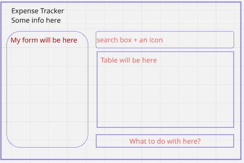

**An expense-Tracker** 
>>Tools: react

**Core Deliverables**

> > building out a React application that displays a list of expenses

As a user, I should be able to:

> > See a table of all my expenses.
> > Fill out and submit the form to add a new expense. This should display the new expense to the table; no persistence mechanism is needed for this.
> > Filter expenses by typing into the search bar. Only expenses with a description or expense name matching the search term should be shown in the expenses table.

**Advanced Deliverables**

As a user, I should be able to:

> > Sort expenses alphabetically by category or description.
> > Delete a specific expense from the table

**other test**

> > Testing is my ability to follow given instructions.

**MVP**
